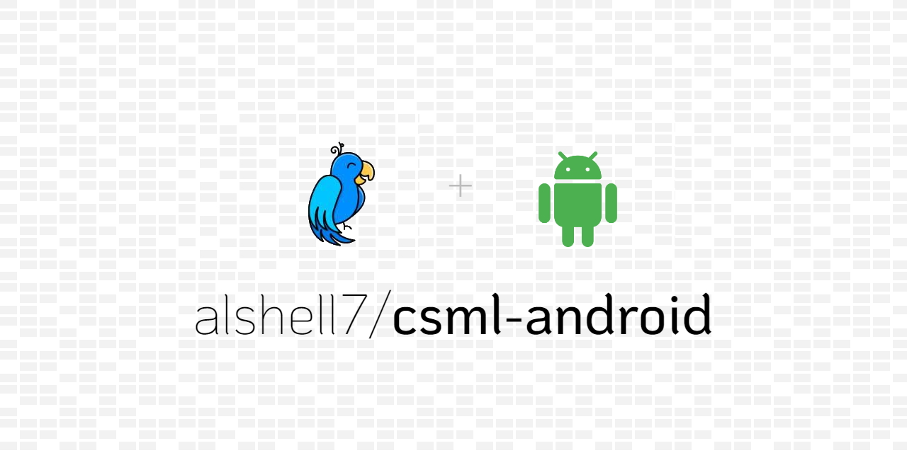

## CSML Android SDK

[]()
[](https://android-arsenal.com/api?level=21)
[](https://jitpack.io/#alshell7/csml-android)
[](https://github.com/CSML-by-Clevy/csml-engine)

An easy-to-use CSML API Client for Android.

## Overview

> [CSML](https://csml.dev) (Conversational Standard Meta Language) is an Open-Source, Domain-Specific Language designed for developing rich conversational experiences easily. It makes creating powerful chatbot's extremely easy. (To learn more about CSML, visit [here](https://docs.csml.dev/language/))

The android library provided in this project is implemented using [Retrofit](https://square.github.io/retrofit/) HTTP client to communicate with CSML Studio [API Channel](https://docs.csml.dev/studio/api/api-reference/chat-api), and for CSML [Self-Hosted](https://github.com/CSML-by-Clevy/csml-engine#self-hosted--cloud--local-installation) (*Support coming in future releases*).

### Features

* Supports following sender Message Components:
  * Text - [Refer](https://docs.csml.dev/language/sending-receiving-messages/message-payloads#text)
  * Image - [Refer](https://docs.csml.dev/language/sending-receiving-messages/message-payloads#image)
  * Audio - [Refer](https://docs.csml.dev/language/sending-receiving-messages/message-payloads#audio)
  * Video - [Refer](https://docs.csml.dev/language/sending-receiving-messages/message-payloads#video)
  * File - [Refer](https://docs.csml.dev/language/sending-receiving-messages/message-payloads#file)
  * URL - [Refer](https://docs.csml.dev/language/sending-receiving-messages/message-payloads#url)
  * Flow Trigger - [Refer]()
* Supports following receiving Message Components:
  * Text - [Refer](https://docs.csml.dev/language/sending-receiving-messages/message-payloads#text)
  * Image - [Refer](https://docs.csml.dev/language/sending-receiving-messages/message-payloads#image)
  * Audio - [Refer](https://docs.csml.dev/language/sending-receiving-messages/message-payloads#audio)
  * Video - [Refer](https://docs.csml.dev/language/sending-receiving-messages/message-payloads#video)
  * File - [Refer](https://docs.csml.dev/language/sending-receiving-messages/message-payloads#file)
  * URL - [Refer](https://docs.csml.dev/language/sending-receiving-messages/message-payloads#url)
  * Button - [Refer](https://docs.csml.dev/language/sending-receiving-messages/message-payloads#button)
  * Question - [Refer](https://docs.csml.dev/language/sending-receiving-messages/message-payloads#question)
  * Typing - [Refer](https://docs.csml.dev/language/sending-receiving-messages/message-payloads#typing)
  * Wait - [Refer](https://docs.csml.dev/language/sending-receiving-messages/message-payloads#wait)
  * Debug - Returns an array of strings when used `debug` in CSML
  * Error - Returns a message string whenever an exception is thrown in the CSML flow.
* Supports Custom Meta Data - [Refer](https://docs.csml.dev/language/memory/global-variables#_metadata-user-level-context)
* Detect Unidentifiable/Custom Incoming Messages
* Smooth encapsulated exception handling
* End-end CSML Studio Bot API support
* Extensively documented Javadoc 🙌🤓

### :sparkles: Demo

To have a check on the library, download the demo [APK](https://github.com/alshell7/csml-android/blob/master/assets/app-debug.apk).

<video src='./assets/demo.mp4' width='180'/>

[This](https://github.com/alshell7/csml-android/blob/master/assets/demo.csml) CSML Flow used for the demo.


## :wrench: Installation

To add CSML Android support in your app, Add the library in your `Project build.gradle` :

```groovy
allprojects {
    repositories {
        ...
        maven { url 'https://jitpack.io' }
    }
}
```

Add the dependency in the `build.gradle (Module: app)` :

```groovy
dependencies {
    compile 'com.github.alshell7:csml-android:{version-number}'
}
```

> Please check the latest release from the Jitpack badge above for the version number.

## :bulb: Usage

### Permissions

* To be able to send messages to the bot and receive the response using this SDK, you must include the internet permission tags in the app's manifest file :

```xml
<uses-permission android:name="android.permission.INTERNET" />
```

### Java

* To instantiate the library and get access to its functions, you need to use the `CSMLEngine` class :

```java
CSMLEngine csmlEngine = new CSMLEngine(String botPublicApiKey, String userId, BotResponseListener defaultBotResponseListener);
```

Where:
  * botPublicApiKey - A public API Key for your API bot. - [Refer](https://docs.csml.dev/studio/api/authentication#public-endpoints-authentication)
  * userId - A client-issued string for tracing requests. If none is provided, will be automatically generated.
  * defaultBotResponseListener - Event trigger received on processing the CSML request.

### **Send Messages** to the bot :

```java
csmlEngine.sendText("Hi there!");

csmlEngine.sendImage("https://IMAGE_URL");

csmlEngine.sendAudio("https://AUDIO_URL");

csmlEngine.sendVideo("https://VIDEO_URL");

csmlEngine.sendFile("https://FILE_URL");

csmlEngine.sendURL("https://SOME_URL", "title", "text");

csmlEngine.sendFlowTrigger("flowID", closeFlows /*true or false*/);
```

### **Receive Messages** from the bot :
The event listener that is used by the `CSMLEngine` :

```java
public interface BotResponseListener {
    /**
     * Triggers when sending the message failed.
     * @param reason A throwable on any exception happened while communicating with CSML Studio/Open-Source
     */
    public void onMessageSendFailed(Throwable reason);

    /**
     * Gets triggered when the bot responds a text message.
     * @param text A Text Message
     */
    public void onTextReceived(Text text);

    /**
     * Gets triggered when the bot responds an Image message.
     * @param image Am Image Message
     */
    public void onImageReceived(Image image);

    /**
     * Gets triggered when the bot responds an Audio message.
     * @param audio Am Audio Message
     */
    public void onAudioReceived(Audio audio);

    /**
     * Gets triggered when the bot responds a Video message.
     * @param video A Video Message
     */
    public void onVideoReceived(Video video);

    /**
     * Gets triggered when the bot responds an URL message.
     * @param url A URL Message
     */
    public void onUrlReceived(URL url);

    /**
     * Gets triggered when the bot responds a File message.
     * @param file A File Message
     */
    public void onFileReceived(File file);

    /**
     * Gets triggered when the bot responds a Button message.
     * @param button A Button Message
     */
    public void onButtonReceived(Button button);

    /**
     * Gets triggered when the bot responds a Question message.
     * @param question A Question Message
     */
    public void onQuestionReceived(Question question);

    /**
     * Gets triggered when the bot responds a Typing simulation message.
     * @param typing A Typing Message
     */
    public void onTypingReceived(Typing typing);

    /**
     * Gets triggered when the bot responds a Wait simulation message.
     * @param wait A Wait Message
     */
    public void onWaitReceived(Wait wait);

    /**
     * Gets triggered when the CSML bot flow prints a debugging message.
     * @param debug A Debug Message
     */
    public void onDebugReceived(Debug debug);

    /**
     * Gets triggered when the CSML bot flow encounters.
     * @param error An Error Message
     */
    public void onErrorReceived(Error error);

    /**
     * Gets triggered when an unidentifiable/custom payload message is received from the CSML flow.
     * @param message An Abstract CSML-Android Message
     */
    public void onUnIdentifiableReceived(Message message);
}
```

You can add multiple event listeners to your CSMLEngine :

```
csmlEngine.addChatResponseListener(BotResponseListener botResponseListener)
```

### :zzz: Few Tips

* The CSMLEngine's API request to CSML Studio are run on the background thread, make sure to render the responses on the UI thread appropriately. Example, to use: `runOnUiThread(() -> { /*Your code here..*/ });`

* It's good to capture `onDebugReceived(Debug debug)` and `onErrorReceived(Error error)`. Can help to identify the issues.

* Found some problems in the library?, feel easy to report it in the [issues](https://github.com/alshell7/csml-android/issues).

## How to Contribute?

1. Fork it :trollface:
2. Create your feature branch (git checkout -b my-new-feature)
3. Commit your changes (git commit -am 'Add some feature')
4. Push to the branch (git push origin my-new-feature)
5. Create new Pull Request :hear_no_evil:

## Licenses

```
MIT License

Copyright (c) 2022 alshell7

Permission is hereby granted, free of charge, to any person obtaining a copy
of this software and associated documentation files (the "Software"), to deal
in the Software without restriction, including without limitation the rights
to use, copy, modify, merge, publish, distribute, sublicense, and/or sell
copies of the Software, and to permit persons to whom the Software is
furnished to do so, subject to the following conditions:

The above copyright notice and this permission notice shall be included in all
copies or substantial portions of the Software.

THE SOFTWARE IS PROVIDED "AS IS", WITHOUT WARRANTY OF ANY KIND, EXPRESS OR
IMPLIED, INCLUDING BUT NOT LIMITED TO THE WARRANTIES OF MERCHANTABILITY,
FITNESS FOR A PARTICULAR PURPOSE AND NONINFRINGEMENT. IN NO EVENT SHALL THE
AUTHORS OR COPYRIGHT HOLDERS BE LIABLE FOR ANY CLAIM, DAMAGES OR OTHER
LIABILITY, WHETHER IN AN ACTION OF CONTRACT, TORT OR OTHERWISE, ARISING FROM,
OUT OF OR IN CONNECTION WITH THE SOFTWARE OR THE USE OR OTHER DEALINGS IN THE
SOFTWARE.
```